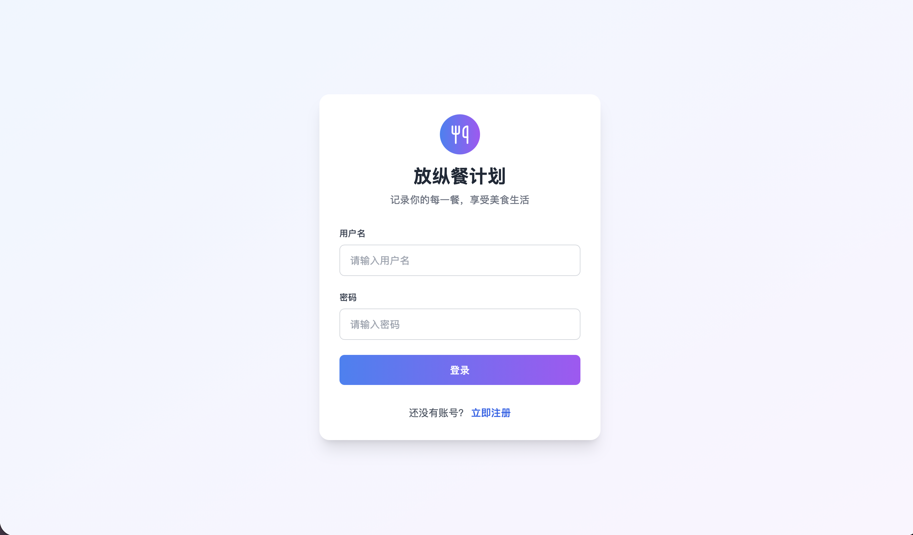
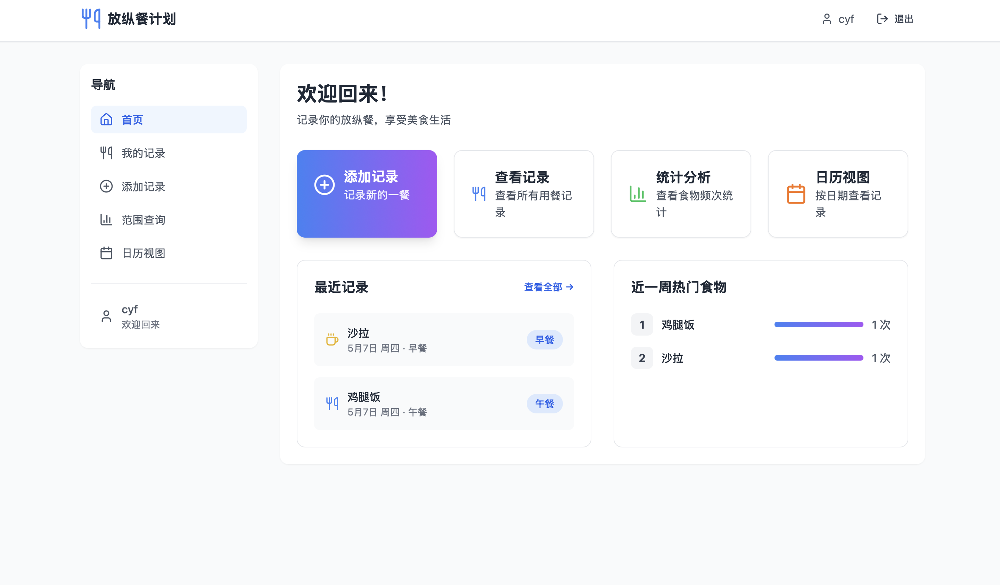
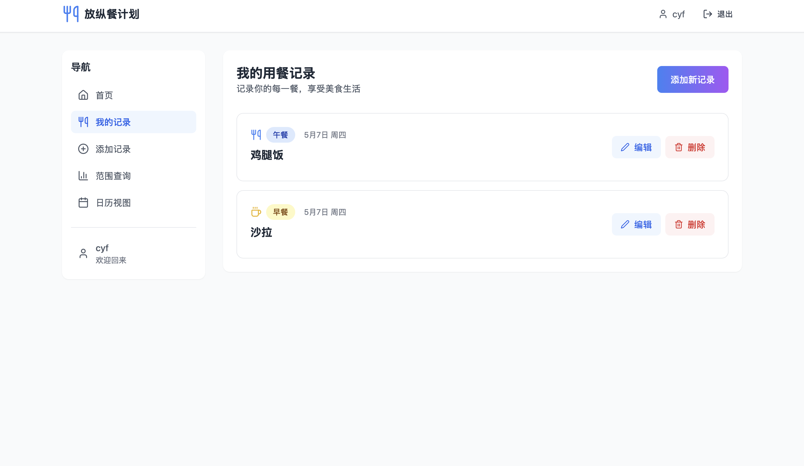
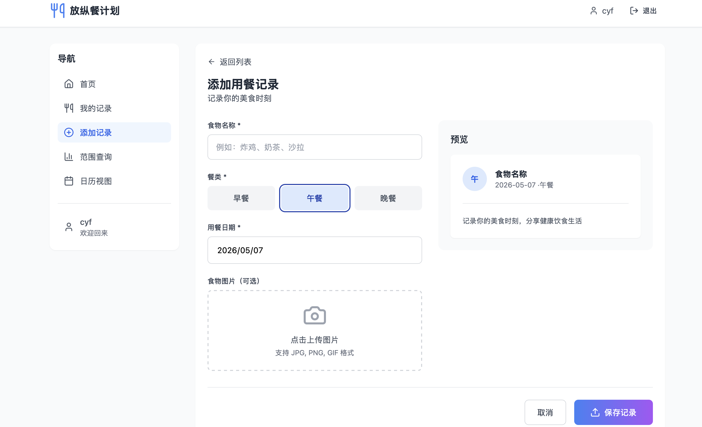
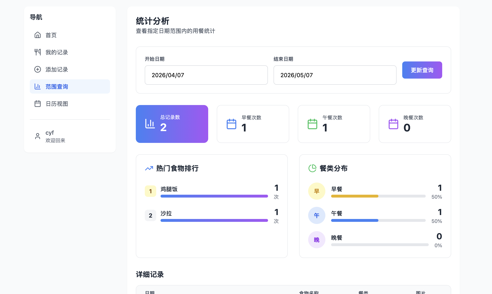
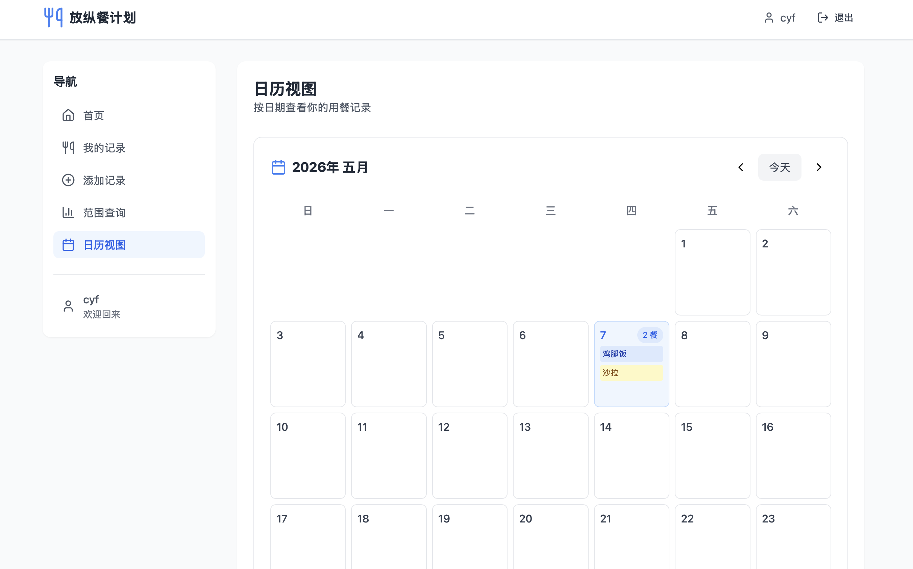

# 放纵餐计划

>go后端学习中。。。。 
>功能不完善，正在逐步增添新功能中。。。   
>前端完全是vibe coding   
>claude code + GLM 5.1 + UI/UX skill

## 启动流程
- 拉取仓库
  
- 进入 **frontend** 
  
- 在终端输入 
  
    `npm install` 安装依赖    
    `npm run dev` 运行前端应用

- 另起一个终端  
  
- 进入项目目录    
  
    `go mod tidy` 安装依赖包    
    `go run main.go` 启动后端应用

- 记得修改 **config.yaml** 文件
  
- 浏览器中输入地址 **http://localhost:3000**

## 运行界面展示

